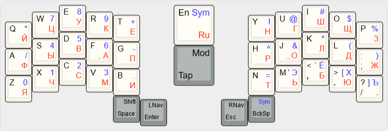

Keeper's layout is a layout for ergo keyboards with 34 keys. 



* [Regular edition](http://www.keyboard-layout-editor.com/#/gists/cacdceee055837862e7ce00b037cfe40) - In most cases, you don't need a full F-row. The main idea was to keep the functionality and logic of the symbols placement using One Shot Mods.
* [Home row mods edition](http://www.keyboard-layout-editor.com/#/gists/6ba9f3a048292bf0aaaea0070cfa03e5) [work in progress] - Similar to the regular variant, but using Home Row Mods
* [Chord edition](http://www.keyboard-layout-editor.com/#/gists/040345e548b089088c43428b2d521e63) [work in progress] - Variant with extensive use of chords.


## The repository contains:
* ```config*.c``` QMK files for 44/42/36/34 keys keyboard
* ```*.json``` files for VIA for jian and corne 
* ```*.json``` KLE files 
* ```*.png```  KLE images


## Use:
### QMK
* Copy qmk/keymap*.c to ```YOUR_KEYBOARD/keymaps/default/``` and rename it to keymap.c
  
* Add to YOUR_KEYBOARD/krules.mk:
  ```
  MOUSEKEY_ENABLE = yes
  ```

* If you need RGB layer indicator(else remove RGB section from keymap.c)
  * Add to ```YOUR_KEYBOARD/krules.mk```:
  ```
  RGBLIGHT_ENABLE = yes
  RGBLIGHT_LAYERS = yes
  ```

  * Add to ```YOUR_KEYBOARD/kconfig.h```:
  ```
  #define RGBLIGHT_LAYERS
  #define RGBLIGHT_MAX_LAYERS 5
  #define RGBLIGHT_LAYERS_OVERRIDE_RGB_OFF
  ```

### VIA [work in progress]
Just load ```via/*.json```

### KLE
Just open link or upload ```kle/*.json``` to [keyboard-layout-editor.com)](keyboard-layout-editor.com)

### ZMK [work in progress]
Copy ```qmk/keymap*.c``` to ```YOUR_KEYBOARD/config/``` and rename it to  ```YOUR_KEYBOARD.keymap```