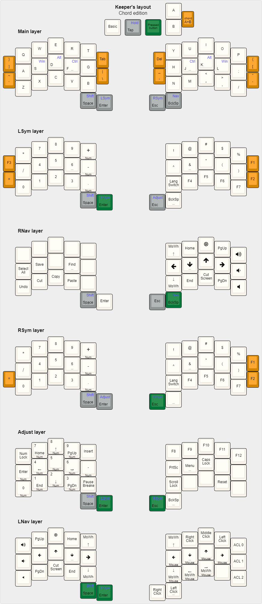

Keeper's layout are 34-key variation of the Watchman's layout. When using chords, it was possible to adapt Watchman's layout for 34-key keyboards with minimal changes.

The layout is not a universal solution, it is a source of inspiration




## Use:
### QMK
Copy ```qmk/*``` to ```YOUR_KEYBOARD/keymaps/default/```

### KLE
Just open link or upload ```kle/*.json``` to [keyboard-layout-editor.com](keyboard-layout-editor.com)

### ZMK [work in progress]
Copy ```zmk``` to ```YOUR_KEYBOARD/config/``` 